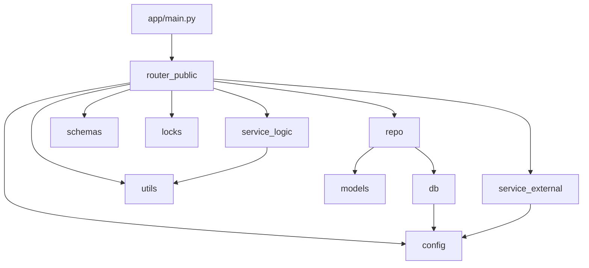
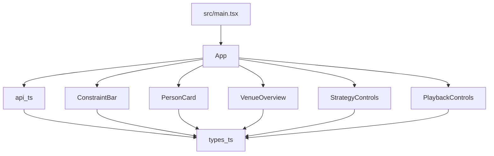
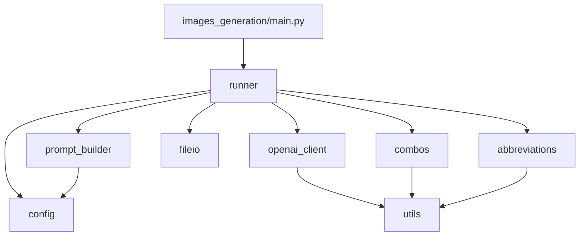

# Dependency Diagram

## Backend Modules

```mermaid
graph TD
    main[app/main.py] --> router_public
    router_public --> repo
    router_public --> service_external
    router_public --> service_logic
    router_public --> schemas
    router_public --> locks
    router_public --> utils
    router_public --> config
    repo --> models
    repo --> db
    db --> config
    service_external --> config
    service_logic --> utils
```

## Frontend Modules

```mermaid
graph TD
    main_tsx[src/main.tsx] --> App
    App --> api_ts
    App --> ConstraintBar
    App --> PersonCard
    App --> VenueOverview
    App --> StrategyControls
    App --> PlaybackControls
    api_ts --> types_ts
    ConstraintBar --> types_ts
    PersonCard --> types_ts
    VenueOverview --> types_ts
    StrategyControls --> types_ts
    PlaybackControls --> types_ts
```

## Images Generation Modules

```mermaid
graph TD
    main_image[images_generation/main.py] --> runner
    runner --> config
    runner --> abbreviations
    runner --> combos
    runner --> fileio
    runner --> openai_client
    runner --> prompt_builder
    openai_client --> utils
    combos --> utils
    abbreviations --> utils
    prompt_builder --> config
```
