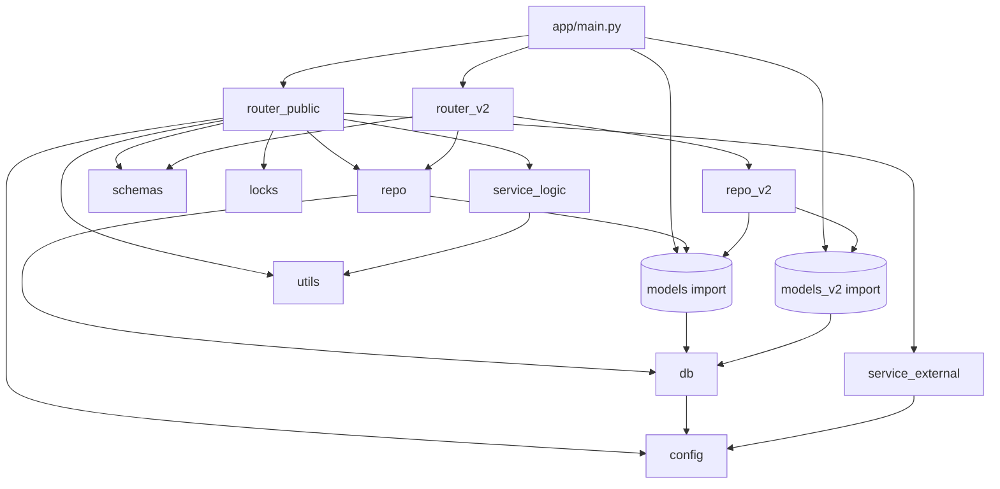
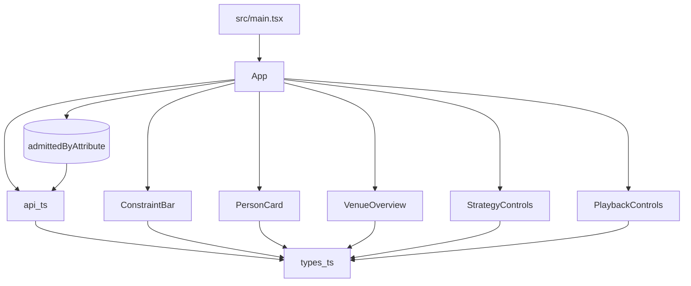
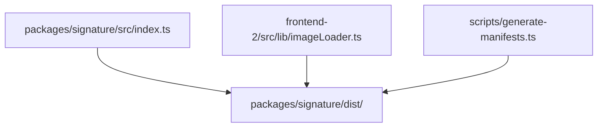

# Dependency Diagram

## Backend Modules


## Frontend v1 Modules


## Frontend v2 Modules
```mermaid
graph TD
    main_tsx[frontend-2/src/main.tsx] --> App
    App --> Header
    App --> SwipeCard
    App --> AutoControls
    App --> ConstraintsPanel
    App --> VenueStats
    App --> FeasibilityBanner
    App --> Modals[LeaderboardModal, SettingsModal, ResultModal]
    App --> Toasts
    App --> hooks[useLocalStorage, useKeyboard, useToast]
    App --> api_ts
    SwipeCard --> imageLoader
    api_ts --> types_ts
    imageLoader --> signature_package[@berghain/signature]
    imageLoader --> types_ts
    Header --> Button
    Modals --> Modal
    Modals --> Button
    Button --> framer_motion
    Modal --> framer_motion
```

## Shared Packages


## Images Generation & Manifest System
```mermaid
graph TD
    main_image[images_generation/main.py] --> runner
    runner --> config
    runner --> abbreviations
    runner --> combos
    runner --> fileio
    runner --> openai_client
    runner --> prompt_builder
    openai_client --> utils
    combos --> utils
    abbreviations --> utils
    prompt_builder --> config
    
    manifest_gen[scripts/generate-manifests.ts] --> signature_package[@berghain/signature]
    manifest_gen --> manifest_output[frontend-2/public/manifest/]
    images_output[images-generation/output/] --> manifest_gen
    frontend2_images[frontend-2/public/people/] --> manifest_gen
```
